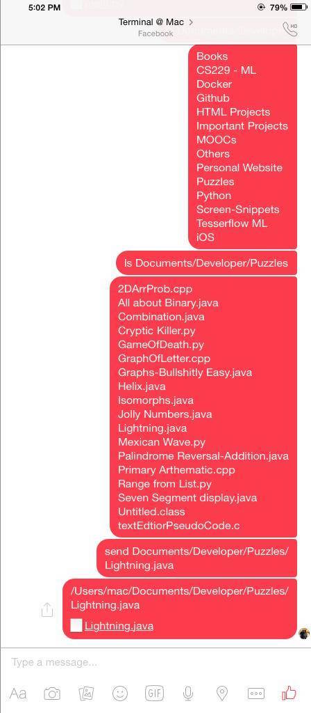

# Terminal on Facebook Messenger (TFM) ver. 1.01

Allows user to take full control of the terminal of their computer through Facebook's messaging service.




##Updates
Added support for sending files and ```cd```. Type following commands on Messenger :

```
cd __dirname
send __filename
```

##Dependencies 
####Selenium
```
pip3 install selenium
```
####[Firefox](https://www.mozilla.org/en-GB/firefox/new/)

##Running
To use the script to full extent, make sure that you keep it at the home directory.
Run it like this :
```
python3 ~/main.py
```

Enter your facebook username and password and wait till it sets up. To make sure that it has setup, your url should be ```'https://facebook.com/messages/*your own username*```.

To send the commands, search for your own name on the messenger and send commands to it

##Future Improvements
- ~~Add support for ```cd```~~
- ~~Send files~~
- Switch to PhantomJS
- Error Logs
- Running in backgroud thread
- Fix all the bugs
