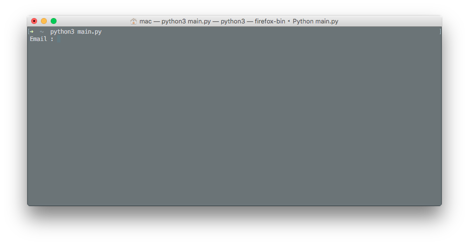

# Terminal on Facebook Messenger 


###TFM ver. 1.9
Allows user to take full control of the terminal of their computer through Facebook's messaging service.


##Disclamer

>I shall not collect users' content or information, or otherwise access Facebook, using automated means (such as harvesting bots, robots, spiders, or scrapers) without our prior permission.


##Run
To use the script to full extent, make sure that you keep it at the home directory.
Run it like this :
```
python ~/main.py
```


Enter your facebook username and password when prompted. 

> Alternatively, you can automate authentication. Create ```settings.txt``` file in repo's folder, and write email and password there in following format:
> ```
> [main]
> email = addresswithoutquotes@gmail.com
> password = passwordwithoutquotes
> ```

Wait till it sets up. To make sure that it has setup, your url should be ```'https://facebook.com/messages/*your own username*```.

To send the commands, search for your own name on the messenger and send commands to it.

>While using the ```set ... as ... ``` command, you can create a file named ``commands.txt`` and write the Alias name in the following format (seperated by single space):
>```
>Alias_command_without_quotes  actual_command_without_quotes
>```
>The file has been included in the repo, which has some useful commands for Mac.

##Dependencies 
###Selenium
```
pip install selenium
```
###Chrome
[Link for proper installation.](https://stackoverflow.com/questions/8255929/running-webdriver-chrome-with-selenium)

##Commands
 Command                                  | Function           
------------------------------------------|--------------------
 ```save file *path/file_name.format*```| Saves the file sent along with the command at the path|
 ```save img *path/image_name.png*``` | Saves the image sent along with the command at the path|
 ```senddir *relative_directory_path*``` | Sends directory after coverting to .zip|
 ```set *new_command_name* as *actual_command*```| Define alias name for command|
 ```show *relative_file_path / URL*```        | Previews any file or a URL |
 ```memory```      | Gives The current Memory Stats of the machine      |
 ```send *relative_file_path*``` | Sends file     |
 ```help``` | Lists the commands that can be used |
 ```quit``` | Quit current session |

**Any other command you might normally use on your CLI.**

##Updates
 - Added ``save img`` and ```save file``` command.
 - File permssion changes for settings.txt on log-in and quitting
 - Added ```senddir``` command.
 - Fixed misc. bugs. 
 - CPU and Chill.
 - Added ```set ... as``` command.
 - Reduced dependencies on machine generated id's and classes.
 -  Auto-authentification from settings file (Pushed by [@tedmx](https://github.com/tedmx)).
 - Disabled Chrome Notifications (Pushed by [@mmplisskin](https://github.com/mmplisskin)).
 - Added show command.

 ```
 show URL (https://www.foo.bar) /Relative FilePath 'Foo/Bar/main.py'
 ```

 - Shifted to Chrome.
 - Faster Log-In .
 - Added ```memory``` command, to get current memory stats of the machine.
 - Added ```quit``` and ```help``` commands.

 ```
 help : Displays the commands which can be used
 quit : quit session
 ```
 - Addded condition for proper log-in.
 - Using getpass() to hide password (Pushed by [@idoqo](https://github.com/idoqo)).
 - Support for Python 2.7 (Pushed by [@amitt001](https://github.com/amitt001)).
 - Added support for sending files and ```cd```. Type following commands on.Messenger :

```
cd __dirPath
send __filePath
```

##Future Improvements
- ~~Add support for ```cd```~~.
- ~~Send files~~.
- Switch to PhantomJS.
- ~~Error Logs~~.
- Running in backgroud thread.
- Fix all the bugs.

##License
[Apache-2.0](https://opensource.org/licenses/Apache-2.0)
